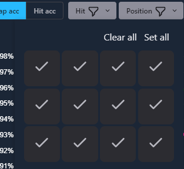

# Beat Leader Replay Analyzer

## Notice

**The project is in early stage. I didn't plan to release it in this state, but currently I don't have free time to work on it. However, I believe that even in its current state, it may prove useful to someone.**

## About

Beat Leader mod saves a replay of every map played on the **local disk**, including those that were no better than PB and failed ones and were not sent to the BL server for that reason. **This program allows you to analyze them**. In addition, if it is run during a BS session, it automatically renames the replays, so they are not overwritten (by default, BL overwrites replays so that only the most recent replay of each map is stored locally) and you can analyze each of your attempts.

Below you will find some [screenshots](#screenshots) if you're curious if it's even worth installing.

## System requirements

The program requires Microsoft WebView2 installed. It is installed by default in Windows 11 and in Windows 10 updated to the latest version. If you have problems running it download and install WebView2 from [Microsoft website](https://developer.microsoft.com/en-us/microsoft-edge/webview2/#download-section).


## Installation

Download the latest version from [Releases page](https://github.com/motzel/replay-analyzer/releases)
and copy it to the ``<Beat Saber installation dir>\UserData\BeatLeader``.  If BS is installed in the default location it is:
``C:\Program Files (x86)\Steam\steamapps\common\Beat Saber\UserData\BeatLeader``

## Known bugs

- The map list is not automatically refreshed in the production build when a new replay appears. A restart of the program is required.
- (kinda) If the program is run during a BS session each replay is stored on disk and therefore you can fill it up quickly if you don't have much free space. Currently, the option to automatically delete older replays is not implemented so you have to do it manually (< BS dir >\UserData\BeatLeader\Replays directory).

## Planned features

If I can find the time for it at all 😉

- [Beat Leader web replays](https://github.com/BeatLeader/BeatSaber-Web-Replays) integration
- automatic removal of replays according to preset criteria (e.g., top three, five newest, etc.).
- downloading replays of other players from the BL server for analysis
- BL API integration (?)
- more stats (everyone loves them, right? ;-)

If you have any suggestions then please submit them via [Issues](https://github.com/motzel/replay-analyzer/issues). If I find time to work on the project I will certainly consider them.

PRs are, of course, very welcome 😁

## Screenshots

Maps view


Map view


Map Acc Chart


Hit Acc Chart


Detailed note cut info


Custom Hit Acc groups


Filtering by hit values


Filtering by note direction


Filtering by note position



## Devs

This project uses great [Wails project](https://github.com/wailsapp/wails) with [Svelte](https://github.com/sveltejs/svelte) frontend to build the executable. Building a project requires [golang](https://go.dev/) 1.18+ and [node](https://nodejs.org/en/) 16+ installed on the computer.

First, go to the ``frontend`` directory and install the dependencies using the command:

```shell
cd frontend
npm install
```

and then:

### Live Development

To run in live development mode, run `wails dev` in the project directory. This will run a Vite development
server that will provide very fast hot reload of your frontend changes. If you want to develop in a browser
and have access to your Go methods, there is also a dev server that runs on http://localhost:34115. Connect
to this in your browser, and you can call your Go code from devtools.

### Building

To build a redistributable, production mode package, use `wails build`. You can find the resulting executable file in the ``build\bin`` directory.
